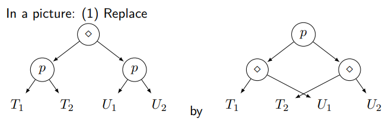

# 使用C++实现ROBDD算法
## 本文简介
笔者使用C++实现了对CTL表达式的求解，允许嵌套且支持多种表达式。本文的主要目的是阐述算法的主要实现流程。文章已分享到知乎https://zhuanlan.zhihu.com/p/535182189
## CTL相关知识
可以参考https://blog.csdn.net/qq_37400312/article/details/112330068，本文不再给出。
## 基本算法
### 决策树
决策树是一颗二进制树，满足：
* 每个节点被布尔变量标记；
* 每个叶子被赋予0或1。

通过从树根开始，如果对应节点变量是true则向左走，否则向右走，直到抵达叶子节点。如果叶子节点是1说明结果是true，否则是false。很显然，任意一个布尔函数都可以用决策树表达。然而，决策树的空间可能非常大。如果节点数量较多，可以考虑合并或消除。

```
    p
0       0
```
如图，P的两个叶子节点均为0，则p可以直接用0替换。
### ROBDD
如果忽略树每个节点入度至多为1这一特点，将所有相同的子节点进行合并，则得到ROBDD，它比决策树更节省空间。
```
            a
    p               s
q       r       r       t
```
如图，a的子节点p和s可以共享r。

ROBDD的运算：
* ROBDD(F)和ROBDD(T)是trival的；
* ROBDD(~p)=ROBDD(p->F)；
* ROBDD(p R q)=apply(ROBDD(p),ROBDD(q),R)，其中R是合取、析取、蕴含、等值的一种。

现在最主要的问题变为计算apply(ROBDD(p),ROBDD(q),R)。事实上，通过以下逻辑关系可以递归化简（这里假设p的左右子树分别为p1和p2，q的左右子树分别为q1和q2。当p或q是叶子节点时，直接可以计算消去运算符号）：
* R(p(p1,p2),p(q1,q2))=p(R(p1,p2),R(q1,q2));
* 当p不在q出现时，R(p(p1,p2),q)=p(R(p1,q),R(p2,q))(p加括号蕴含p是最上层的一个节点，q也一样);
* 当q不在p出现时，R(p,q(q1,q2))=q(R(p,q1),R(p,q2)).

可以通过下图直观理解：  


### 对EX,EG,EU的求解
对它们的求解归根结底在形式化求解$\{s \in T | \exists t \in U : s\to t\}$的ROBDD。
例如，对于EG，可以按如下步骤求解：
* $T_0=S_{\phi};n=0$
* repeat $T_{n+1}=T_n\cap\{s\in S_{\phi}|\exists t\in T_n:s\to t\};n=n+1$ until $T_n=T_{n-1}$。
* $ROBDD(T_n)$即为所求。

$s\to t$可以分解为：
* $P_1=(a_1,\cdots,a_n)\to(a_1',\cdots,a_n')$
* $P_2=(a_1',\cdots,a_n')\in U$
* $P=P_1\wedge P_2$

这里$P_1$可以理解成a表示的点在图上连到a'表示的点。
存在性可以通过尝试得出。假设$\{s \in T | \exists t \in U : s\to t\}$计算结果为V，则$V=T\cap S_{P_e}$，其中$S_{P_e}= \{(a_1, \cdots , a_n) | \exists a_1',\cdots,a_n':P(a_1,\cdots,a_n,a_1',\cdots,a_n')\}$。
## 代码详解
首先定义基本图类，仅包括增边、增加节点操作：
```c++
//Graph.h
#pragma once
#include<vector>
#include<cstdlib>
using namespace std;
struct GraphNode
{
	int value;
	vector<GraphNode*> next;
	vector<int> nextidx; //corresponding index
};
class Graph
{
public:
	int num_nodes;
	vector<GraphNode*> nodes;
	Graph();
	void AddNode(int value);
	void AddEdge(int nodesrc, int nodedst); //Add an edge from nodesrc to nodedst
};
```
```c++
//Graph.cpp
#include "Graph.h"

Graph::Graph()
{
	num_nodes = 0;
}

void Graph::AddNode(int value)
{
	num_nodes++;
	GraphNode* NewNode = new GraphNode;
	nodes.push_back(NewNode);
	nodes[num_nodes - 1]->value = value;
}

void Graph::AddEdge(int nodesrc, int nodedst)
{
	if (nodesrc < 0 || nodedst < 0 || nodesrc >= num_nodes || nodedst >= num_nodes) throw "Added an illegal edge!";
	nodes[nodesrc]->next.push_back(nodes[nodedst]);
	nodes[nodesrc]->nextidx.push_back(nodedst);
}
```
对于ROBDD，建立了一个ROBDD类，支持由图转化（已废弃但是还能用）、由真值表转化、化简、打印 、克隆（保持拓扑结构）、查找结果、拓扑等价判定(Equal)、逻辑运算、三种CTL运算。ROBDD类的nodes保存了节点指针，方便遍历。
```c++
//ROBDD.h
#pragma once
#include<vector>
#include"Graph.h"
using namespace std;
struct ROBDDNode
{
	int label; //-1 for leaf
	union
	{
		struct
		{
			ROBDDNode* true_branch;
			ROBDDNode* false_branch;
		}successor;
		int value;
	}value;
};
ROBDDNode* Clone(ROBDDNode* src);
bool Contain(ROBDDNode* node, int label);
class ROBDD
{
public:
	ROBDDNode* root;
	vector<ROBDDNode*> nodes;
	void ConvertFromGraph(Graph graph);
	void FromTrueValueVector(vector<int> TrueValues);
	void Simplify();
	void Print();
	ROBDD CloneROBDD();
	bool Walk(int path, int pathlen); //walk down the path, see if it ends.
};
vector<ROBDDNode*> NodeVector(ROBDDNode* StartVector);
bool Equal(ROBDDNode* node1, ROBDDNode* node2);
ROBDD AND(ROBDD robdd1, ROBDD robdd2);
ROBDD OR(ROBDD robdd1, ROBDD robdd2);
ROBDD IMPLY(ROBDD robdd1, ROBDD robdd2);
ROBDD NOT(ROBDD robdd);
ROBDD EX(Graph G, ROBDD robdd);
ROBDD EG(Graph G, ROBDD robdd);
ROBDD EU(Graph G, ROBDD robdd1, ROBDD robdd2);
```
label的说明：为执行CTL，需要把整数分解为二进制数，label标志着二进制数从高到低的位。进行结果判定时，应该检测当前label的值，根据是否为true进行下一个节点label的检测。比如，4->100，节点将有三个label值。检测时label0对应1，label1和label2对应0。检测结果是ROBDD顺着这条路径走到的叶子节点。

首先识别相等判定：递归检查label值，如果全部对应上则说明相等。
如未特殊说明，下面的代码均在ROBDD.cpp中。
```c++
bool Equal(ROBDDNode* node1, ROBDDNode* node2) //label cannot be less than -1
{
	if (node1->label == -1 && node2->label == -1)
	{
		if (node1->value.value == node2->value.value) return true;
		else return false;
	}
	else if (node1->label == -1 || node2->label == -1) return false;
	else return Equal(node1->value.successor.true_branch, node2->value.successor.true_branch) & Equal(node1->value.successor.false_branch, node2->value.successor.false_branch);
}
```
从图转ROBDD：  
对于每一个值为true的节点，将节点标号翻译为二进制数，在已有ROBDD中按二进制数对应的路往下走。如果发现走到头，需要创建一个ROBDD节点，直到走完整个二进制数。最后一步到达的为叶子节点，需要修改节点属性。到最后，需要将ROBDD化简。
```c++
void ROBDD::ConvertFromGraph(Graph graph)
{
	if (!nodes.empty()) nodes.clear();
	root = new ROBDDNode; //root
	root->value.successor.true_branch = root->value.successor.false_branch = NULL;
	root->label = 0;
	nodes.push_back(root);
	int depth = ceil(log2(graph.num_nodes));
	ROBDDNode* current;
	for (int i = 0; i < graph.num_nodes; i++)
	{
		if (graph.nodes[i]->value == 0) continue;
		vector<bool> path = IntToBinVec(i, depth);
		current = root;
		for (int j = 0; j < path.size(); j++)
		{
			if (path[j] == true)  //walk to true branch
			{
				if (current->value.successor.true_branch == NULL) //create a new node
				{
					ROBDDNode* NewNode = new ROBDDNode;
					current->label = j;
					current->value.successor.true_branch = NewNode;
					NewNode->label = j + 1;
					NewNode->value.successor.true_branch = NULL;
					NewNode->value.successor.false_branch = NULL;
					nodes.push_back(NewNode);
					current = NewNode;
				}
				else //move down current
				{
					current = current->value.successor.true_branch;
				}
			}
			else //walk to false branch
			{
				if (current->value.successor.false_branch == NULL) //create a new node
				{
					ROBDDNode* NewNode = new ROBDDNode;
					current->label = j;
					current->value.successor.false_branch = NewNode;
					NewNode->value.successor.true_branch = NULL;
					NewNode->value.successor.false_branch = NULL;
					NewNode->label = j + 1;
					nodes.push_back(NewNode);
					current = NewNode;
				}
				else //move down current
				{
					current = current->value.successor.false_branch;
				}
			}
		}
		current->label = -1; //convert the last node to leaf
		current->value.value = 1;
	}
	vector<ROBDDNode*> NodeToAdd;
	for (int i = 0; i < nodes.size(); i++) //assign false leaves
	{
		if (nodes[i]->label != -1 && nodes[i]->value.successor.true_branch == NULL)
		{
			ROBDDNode* NewNode = new ROBDDNode;
			NewNode->label = -1;
			NewNode->value.value = 0;
			nodes[i]->value.successor.true_branch = NewNode;
			NodeToAdd.push_back(NewNode);
		}
		if (nodes[i]->label != -1 && nodes[i]->value.successor.false_branch == NULL)
		{
			ROBDDNode* NewNode = new ROBDDNode;
			NewNode->label = -1;
			NewNode->value.value = 0;
			nodes[i]->value.successor.false_branch = NewNode;
			NodeToAdd.push_back(NewNode);
		}
	}
	for (int i = 0; i < NodeToAdd.size(); i++) nodes.push_back(NodeToAdd[i]);
	Simplify();
}
```
ROBDD的化简：当某节点的左右子树相同时，可以消除这个节点把它用左右子树代替：
```c++
if (nodes[i]->label != -1 && Equal(nodes[i]->value.successor.true_branch, nodes[i]->value.successor.false_branch))
{
    nodes[i]->label = nodes[i]->value.successor.true_branch->label;
    if (nodes[i]->value.successor.true_branch->label == -1)
        nodes[i]->value.value = nodes[i]->value.successor.true_branch->value.value;
    else
    {
        nodes[i]->value.successor.true_branch = nodes[i]->value.successor.false_branch->value.successor.true_branch;
        nodes[i]->value.successor.false_branch = nodes[i]->value.successor.false_branch->value.successor.false_branch;
    }
    flag = 1;
}
```
当两个节点中一个节点的子树和另一个节点的子树拓扑等价时，可以考虑合并，删除一个多余的子树（如下代码仅展示一种情况）。
```c++
if (nodes[j]->value.successor.true_branch != nodes[i]->value.successor.false_branch&&Equal(nodes[j]->value.successor.true_branch, nodes[i]->value.successor.false_branch))
{
    flag = 1;
    for (vector<ROBDDNode*>::iterator ite = nodes.begin(); ite != nodes.end(); ite++)
    {
        if (*ite == nodes[j]->value.successor.true_branch)
        {
            nodes[j]->value.successor.true_branch = nodes[i]->value.successor.false_branch;
            goto erase;
        }
    }
}
```
完整代码：
```c++
void ROBDD::Simplify() //label nannot be less than -1
{
	int flag;
	do
	{
		flag = 0;
		for (int i = 0; i < nodes.size(); i++)
		{
			if (nodes[i]->label != -1 && Equal(nodes[i]->value.successor.true_branch, nodes[i]->value.successor.false_branch))
			{
				nodes[i]->label = nodes[i]->value.successor.true_branch->label;
				if (nodes[i]->value.successor.true_branch->label == -1)
					nodes[i]->value.value = nodes[i]->value.successor.true_branch->value.value;
				else
				{
					nodes[i]->value.successor.true_branch = nodes[i]->value.successor.false_branch->value.successor.true_branch;
					nodes[i]->value.successor.false_branch = nodes[i]->value.successor.false_branch->value.successor.false_branch;
				}
				flag = 1;
			}
		}
		nodes = NodeVector(root);
		for (int i = 0; i < nodes.size(); i++) //merge
		{
			for (int j = i + 1; j < nodes.size(); j++)
			{
				if (nodes[i]->label == -1 || nodes[j]->label == -1) continue;
				if (nodes[j]->value.successor.false_branch != nodes[i]->value.successor.false_branch&&Equal(nodes[j]->value.successor.false_branch, nodes[i]->value.successor.false_branch))
				{
					flag = 1;
					for (vector<ROBDDNode*>::iterator ite = nodes.begin(); ite != nodes.end(); ite++)
					{
						if (*ite == nodes[j]->value.successor.false_branch)
						{
							nodes[j]->value.successor.false_branch = nodes[i]->value.successor.false_branch;
							goto erase;
						}
					}
				}
				if (nodes[j]->value.successor.false_branch != nodes[i]->value.successor.true_branch&&Equal(nodes[j]->value.successor.false_branch, nodes[i]->value.successor.true_branch))
				{
					flag = 1;
					for (vector<ROBDDNode*>::iterator ite = nodes.begin(); ite != nodes.end(); ite++)
					{
						if (*ite == nodes[j]->value.successor.false_branch)
						{
							nodes[j]->value.successor.false_branch = nodes[i]->value.successor.true_branch;
							goto erase;
						}
					}
				}
				if (nodes[j]->value.successor.true_branch != nodes[i]->value.successor.false_branch&&Equal(nodes[j]->value.successor.true_branch, nodes[i]->value.successor.false_branch))
				{
					flag = 1;
					for (vector<ROBDDNode*>::iterator ite = nodes.begin(); ite != nodes.end(); ite++)
					{
						if (*ite == nodes[j]->value.successor.true_branch)
						{
							nodes[j]->value.successor.true_branch = nodes[i]->value.successor.false_branch;
							goto erase;
						}
					}
				}
				if (nodes[j]->value.successor.true_branch != nodes[i]->value.successor.true_branch&&Equal(nodes[j]->value.successor.true_branch, nodes[i]->value.successor.true_branch))
				{
					flag = 1;
					for (vector<ROBDDNode*>::iterator ite = nodes.begin(); ite != nodes.end(); ite++)
					{
						if (*ite == nodes[j]->value.successor.true_branch)
						{
							nodes[j]->value.successor.true_branch = nodes[i]->value.successor.true_branch;
							goto erase;
						}
					}
				}
			}
		}
	erase:;
		nodes = NodeVector(root);
	} while (flag);
}
```
根据真值表生成ROBDD其实和根据图很像，只是把对应true的节点标号换成了真值表向量中给定的数据：
```c++
void ROBDD::FromTrueValueVector(vector<int> TrueValues)
{
	if (!nodes.empty()) nodes.clear();
	root = new ROBDDNode; //root
	root->value.successor.true_branch = root->value.successor.false_branch = NULL;
	root->label = 0;
	nodes.push_back(root);
	int max = 0;
	for (int i = 0; i < TrueValues.size(); i++)
	{
		if (TrueValues[i] > max) max = TrueValues[i];
	}
	int depth = ceil(log2(max + 1));
	ROBDDNode* current;
	for (int i = 0; i < TrueValues.size(); i++)
	{
		vector<bool> path = IntToBinVec(TrueValues[i], depth);
		current = root;
		for (int j = 0; j < path.size(); j++)
		{
			if (path[j] == true)  //walk to true branch
			{
				if (current->value.successor.true_branch == NULL) //create a new node
				{
					ROBDDNode* NewNode = new ROBDDNode;
					current->label = j;
					current->value.successor.true_branch = NewNode;
					NewNode->label = j + 1;
					NewNode->value.successor.true_branch = NULL;
					NewNode->value.successor.false_branch = NULL;
					nodes.push_back(NewNode);
					current = NewNode;
				}
				else //move down current
				{
					current = current->value.successor.true_branch;
				}
			}
			else //walk to false branch
			{
				if (current->value.successor.false_branch == NULL) //create a new node
				{
					ROBDDNode* NewNode = new ROBDDNode;
					current->label = j;
					current->value.successor.false_branch = NewNode;
					NewNode->value.successor.true_branch = NULL;
					NewNode->value.successor.false_branch = NULL;
					NewNode->label = j + 1;
					nodes.push_back(NewNode);
					current = NewNode;
				}
				else //move down current
				{
					current = current->value.successor.false_branch;
				}
			}
		}
		current->label = -1; //convert the last node to leaf
		current->value.value = 1;
	}
	vector<ROBDDNode*> NodeToAdd;
	for (int i = 0; i < nodes.size(); i++) //assign false leaves
	{
		if (nodes[i]->label != -1 && nodes[i]->value.successor.true_branch == NULL)
		{
			ROBDDNode* NewNode = new ROBDDNode;
			NewNode->label = -1;
			NewNode->value.value = 0;
			nodes[i]->value.successor.true_branch = NewNode;
			NodeToAdd.push_back(NewNode);
		}
		if (nodes[i]->label != -1 && nodes[i]->value.successor.false_branch == NULL)
		{
			ROBDDNode* NewNode = new ROBDDNode;
			NewNode->label = -1;
			NewNode->value.value = 0;
			nodes[i]->value.successor.false_branch = NewNode;
			NodeToAdd.push_back(NewNode);
		}
	}
	for (int i = 0; i < NodeToAdd.size(); i++) nodes.push_back(NodeToAdd[i]);
	Simplify();
}
```
打印函数很容易实现。这里把节点地址和节点标号做了一个哈希映射，这样可以方便显示出节点标号，有利于调试。输出括号中(test xxx)是指节点对应的label是xxx，经过这个节点时需要对xxx做测试以决定下一步要到的节点。
```c++
void ROBDD::Print() //label cannot be less than -1
{
	map<ROBDDNode*, int> ID;
	for (int i = 0; i < nodes.size(); i++) ID[nodes[i]] = i;
	for (int i = 0; i < nodes.size(); i++)
	{
		if (nodes[i]->label != -1)
		{
			if (nodes[i]->value.successor.false_branch->label != -1)
				cout << ID[nodes[i]] << "(tests x" << nodes[i]->label << ")" << "  ----False---->  " << ID[nodes[i]->value.successor.false_branch] << endl;
			else
				if (nodes[i]->value.successor.false_branch->value.value == 1)
					cout << ID[nodes[i]] << "(tests x" << nodes[i]->label << ")" << "  ----False---->  " << ID[nodes[i]->value.successor.false_branch] << "(True)" << endl;
				else
					cout << ID[nodes[i]] << "(tests x" << nodes[i]->label << ")" << "  ----False---->  " << ID[nodes[i]->value.successor.false_branch] << "(False)" << endl;
			if (nodes[i]->value.successor.true_branch->label != -1)
				cout << ID[nodes[i]] << "(tests x" << nodes[i]->label << ")" << "  ----True---->  " << ID[nodes[i]->value.successor.true_branch] << endl;
			else
				if (nodes[i]->value.successor.true_branch->value.value == 1)
					cout << ID[nodes[i]] << "(tests x" << nodes[i]->label << ")" << "  ----True---->  " << ID[nodes[i]->value.successor.true_branch] << "(True)" << endl;
				else
					cout << ID[nodes[i]] << "(tests x" << nodes[i]->label << ")" << "  ----True---->  " << ID[nodes[i]->value.successor.true_branch] << "(False)" << endl;
		}
		else
		{
			if (nodes[i]->value.value == 1)
				cout << ID[nodes[i]] << "  stands for True" << endl;
			else
				cout << ID[nodes[i]] << "  stands for False" << endl;
		}
	}
}
```
遍历结果：
```c++
bool ROBDD::Walk(int path, int pathlen)
{
	vector<bool> _path = IntToBinVec(path, pathlen);
	ROBDDNode* current = root;
	for (int i = 0; i < _path.size(); i++)
	{
		if (i != current->label) continue;
		if (_path[i]) current = current->value.successor.true_branch;
		else current = current->value.successor.false_branch;
	}
	if (current->value.value == 0) return false;
	return true;
}
```
这里需要在参数指定二进制路径的长度。

由于nodes不好实时管理，写了一个可以自动从根节点遍历并生成节点列表的函数：
```c++

vector<ROBDDNode*> NodeVector(ROBDDNode * StartVector)
{
	vector<ROBDDNode*> ret, TrueBranch, FalseBranch;
	ret.push_back(StartVector);
	if (StartVector->label >= 0)
	{
		TrueBranch = NodeVector(StartVector->value.successor.true_branch);
		FalseBranch = NodeVector(StartVector->value.successor.false_branch);
		for (int i = 0; i < TrueBranch.size(); i++)
		{
			vector<ROBDDNode*>::iterator it;
			it = find(ret.begin(), ret.end(), TrueBranch[i]);
			if (it != ret.end()) continue;
			ret.push_back(TrueBranch[i]);
		}
		for (int i = 0; i < FalseBranch.size(); i++)
		{
			vector<ROBDDNode*>::iterator it;
			it = find(ret.begin(), ret.end(), FalseBranch[i]);
			if (it != ret.end()) continue;
			ret.push_back(FalseBranch[i]);
		}
	}
	return ret;
}
```
节点的克隆由函数Clone实现：
```c++
ROBDDNode * Clone(ROBDDNode* src)
{
	ROBDDNode* ret = new ROBDDNode;
	if (src->label < 0)
	{
		ret->label = src->label;
		ret->value.value = src->value.value;
		return ret;
	}
	ret->label = src->label;
	ret->value.successor.false_branch = Clone(src->value.successor.false_branch);
	ret->value.successor.true_branch = Clone(src->value.successor.true_branch);
	return ret;
}
```
先复制节点值，再递归复刻左右子树的结构。

ROBDD类的整体克隆：
```c++
ROBDD ROBDD::CloneROBDD()
{
	ROBDD ret;
	ret.root = Clone(root);
	ret.nodes = NodeVector(ret.root);
	ret.Simplify();
	return ret;
}
```
逻辑运算：按照前述知识提到的几种方法递归地将运算符号逐层下移，直到有一个操作数是True或False。以AND为例：
```c++
ROBDD AND(ROBDD robdd1, ROBDD robdd2)
{
	ROBDD cloned_left = robdd1.CloneROBDD();
	ROBDD cloned_right = robdd2.CloneROBDD();
	ROBDD robdd_false;
	ROBDDNode* NewNode = new ROBDDNode;
	NewNode->label = -1;
	NewNode->value.value = 0;
	robdd_false.nodes.push_back(NewNode);
	robdd_false.root = NewNode;
	if (cloned_left.nodes.size() == 1)
	{
		if (cloned_left.root->value.value == 1) return cloned_right;
		else return robdd_false;
	}
	if (cloned_right.nodes.size() == 1)
	{
		if (cloned_right.root->value.value == 1) return cloned_left;
		else return robdd_false;
	}
	if (robdd1.root->label == robdd2.root->label)
	{
		ROBDD TrueROBDD, FalseROBDD;
		ROBDD cloned_left_left, cloned_left_right, cloned_right_left, cloned_right_right;
		NewNode = Clone(cloned_left.root->value.successor.true_branch);
		cloned_left_left.root = NewNode;
		cloned_left_left.nodes = NodeVector(cloned_left_left.root);
		NewNode = Clone(cloned_left.root->value.successor.false_branch);
		cloned_left_right.root = NewNode;
		cloned_left_right.nodes = NodeVector(cloned_left_right.root);
		NewNode = Clone(cloned_right.root->value.successor.true_branch);
		cloned_right_left.root = NewNode;
		cloned_right_left.nodes = NodeVector(cloned_right_left.root);
		NewNode = Clone(cloned_right.root->value.successor.false_branch);
		cloned_right_right.root = NewNode;
		cloned_right_right.nodes = NodeVector(cloned_right_right.root);
		TrueROBDD = AND(cloned_left_left, cloned_right_left);
		FalseROBDD = AND(cloned_left_right, cloned_right_right);
		ROBDD ret;
		ret.root = new ROBDDNode;
		ret.root->label = robdd1.root->label;
		ret.root->value.successor.true_branch = TrueROBDD.root;
		ret.root->value.successor.false_branch = FalseROBDD.root;
		ret.nodes = NodeVector(ret.root);
		ret.Simplify();
		return ret;
	}
	ROBDD ret;
	if (!Contain(cloned_right.root, cloned_left.root->label))
	{
		ROBDD TrueROBDD, FalseROBDD;
		ROBDD cloned_left_left, cloned_left_right;
		NewNode = Clone(cloned_left.root->value.successor.true_branch);
		cloned_left_left.root = NewNode;
		cloned_left_left.nodes = NodeVector(cloned_left_left.root);
		NewNode = Clone(cloned_left.root->value.successor.false_branch);
		cloned_left_right.root = NewNode;
		cloned_left_right.nodes = NodeVector(cloned_left_right.root);
		TrueROBDD = AND(cloned_left_left, cloned_right);
		FalseROBDD = AND(cloned_left_right, cloned_right);
		ret.root = new ROBDDNode;
		ret.root->label = robdd1.root->label;
		ret.root->value.successor.true_branch = TrueROBDD.root;
		ret.root->value.successor.false_branch = FalseROBDD.root;
	}
	else
	{
		ROBDD TrueROBDD, FalseROBDD;
		ROBDD cloned_right_left, cloned_right_right;
		NewNode = Clone(cloned_right.root->value.successor.true_branch);
		cloned_right_left.root = NewNode;
		cloned_right_left.nodes = NodeVector(cloned_right_left.root);
		NewNode = Clone(cloned_right.root->value.successor.false_branch);
		cloned_right_right.root = NewNode;
		cloned_right_right.nodes = NodeVector(cloned_right_right.root);
		TrueROBDD = AND(cloned_right_left, cloned_left);
		FalseROBDD = AND(cloned_right_right, cloned_left);
		ret.root = new ROBDDNode;
		ret.root->label = robdd2.root->label;
		ret.root->value.successor.true_branch = TrueROBDD.root;
		ret.root->value.successor.false_branch = FalseROBDD.root;
	}
	ret.nodes = NodeVector(ret.root);
	for (int i = 0; i < ret.nodes.size(); i++)
	{
		if (ret.nodes[i]->label == 0)
		{
			ret.root = ret.nodes[i];
			break;
		}
	}
	ret.nodes = NodeVector(ret.root);
	ret.Simplify();
	return ret;
}
```
函数Contain表示包含关系，接受第一个参数作为带搜索树的根节点，第二个参数作为标签。如果子树存在该标签，则返回1，否则返回0。
```c++
bool Contain(ROBDDNode * node, int label)
{
	vector<ROBDDNode*> nodes;
	nodes = NodeVector(node);
	for (int i = 0; i < nodes.size(); i++)
	{
		if (nodes[i]->label == label) return true;
	}
	return false;
}
```
其余逻辑函数实现方法大同小异。
```c++
ROBDD OR(ROBDD robdd1, ROBDD robdd2)
{
	ROBDD cloned_left = robdd1.CloneROBDD();
	ROBDD cloned_right = robdd2.CloneROBDD();
	ROBDD robdd_true;
	ROBDDNode* NewNode = new ROBDDNode;
	NewNode->label = -1;
	NewNode->value.value = 1;
	robdd_true.nodes.push_back(NewNode);
	robdd_true.root = NewNode;
	if (cloned_left.nodes.size() == 1)
	{
		if (cloned_left.root->value.value == 1) return robdd_true;
		else return cloned_right;
	}
	if (cloned_right.nodes.size() == 1)
	{
		if (cloned_right.root->value.value == 1) return robdd_true;
		else return cloned_left;
	}
	if (robdd1.root->label == robdd2.root->label)
	{
		ROBDD TrueROBDD, FalseROBDD;
		ROBDD cloned_left_left, cloned_left_right, cloned_right_left, cloned_right_right;
		NewNode = Clone(cloned_left.root->value.successor.true_branch);
		cloned_left_left.root = NewNode;
		cloned_left_left.nodes = NodeVector(cloned_left_left.root);
		NewNode = Clone(cloned_left.root->value.successor.false_branch);
		cloned_left_right.root = NewNode;
		cloned_left_right.nodes = NodeVector(cloned_left_right.root);
		NewNode = Clone(cloned_right.root->value.successor.true_branch);
		cloned_right_left.root = NewNode;
		cloned_right_left.nodes = NodeVector(cloned_right_left.root);
		NewNode = Clone(cloned_right.root->value.successor.false_branch);
		cloned_right_right.root = NewNode;
		cloned_right_right.nodes = NodeVector(cloned_right_right.root);
		TrueROBDD = OR(cloned_left_left, cloned_right_left);
		FalseROBDD = OR(cloned_left_right, cloned_right_right);
		ROBDD ret;
		ret.root = new ROBDDNode;
		ret.root->label = robdd1.root->label;
		ret.root->value.successor.true_branch = TrueROBDD.root;
		ret.root->value.successor.false_branch = FalseROBDD.root;
		ret.nodes = NodeVector(ret.root);
		ret.Simplify();
		return ret;
	}
	ROBDD ret;
	if (!Contain(cloned_right.root, cloned_left.root->label))
	{
		ROBDD TrueROBDD, FalseROBDD;
		ROBDD cloned_left_left, cloned_left_right;
		NewNode = Clone(cloned_left.root->value.successor.true_branch);
		cloned_left_left.root = NewNode;
		cloned_left_left.nodes = NodeVector(cloned_left_left.root);
		NewNode = Clone(cloned_left.root->value.successor.false_branch);
		cloned_left_right.root = NewNode;
		cloned_left_right.nodes = NodeVector(cloned_left_right.root);
		TrueROBDD = OR(cloned_left_left, cloned_right);
		FalseROBDD = OR(cloned_left_right, cloned_right);
		ret.root = new ROBDDNode;
		ret.root->label = robdd1.root->label;
		ret.root->value.successor.true_branch = TrueROBDD.root;
		ret.root->value.successor.false_branch = FalseROBDD.root;
	}
	else
	{
		ROBDD TrueROBDD, FalseROBDD;
		ROBDD cloned_right_left, cloned_right_right;
		NewNode = Clone(cloned_right.root->value.successor.true_branch);
		cloned_right_left.root = NewNode;
		cloned_right_left.nodes = NodeVector(cloned_right_left.root);
		NewNode = Clone(cloned_right.root->value.successor.false_branch);
		cloned_right_right.root = NewNode;
		cloned_right_right.nodes = NodeVector(cloned_right_right.root);
		TrueROBDD = OR(cloned_right_left, cloned_left);
		FalseROBDD = OR(cloned_right_right, cloned_left);
		ret.root = new ROBDDNode;
		ret.root->label = robdd2.root->label;
		ret.root->value.successor.true_branch = TrueROBDD.root;
		ret.root->value.successor.false_branch = FalseROBDD.root;
	}
	ret.nodes = NodeVector(ret.root);
	for (int i = 0; i < ret.nodes.size(); i++)
	{
		if (ret.nodes[i]->label == 0)
		{
			ret.root = ret.nodes[i];
			break;
		}
	}
	ret.nodes = NodeVector(ret.root);
	ret.Simplify();
	return ret;
}

ROBDD IMPLY(ROBDD robdd1, ROBDD robdd2)
{
	ROBDD cloned_left = robdd1.CloneROBDD();
	ROBDD cloned_right = robdd2.CloneROBDD();
	ROBDD robdd_true;
	ROBDDNode* NewNode = new ROBDDNode;
	NewNode->label = -1;
	NewNode->value.value = 1;
	robdd_true.nodes.push_back(NewNode);
	robdd_true.root = NewNode;
	if (cloned_left.nodes.size() == 1)
	{
		if (cloned_left.root->value.value == 1) return cloned_right;
		else return robdd_true;
	}
	if (cloned_right.nodes.size() == 1)
	{
		if (cloned_right.root->value.value == 1) return robdd_true;
		else return cloned_left;
	}
	if (robdd1.root->label == robdd2.root->label)
	{
		ROBDD TrueROBDD, FalseROBDD;
		ROBDD cloned_left_left, cloned_left_right, cloned_right_left, cloned_right_right;
		NewNode = Clone(cloned_left.root->value.successor.true_branch);
		cloned_left_left.root = NewNode;
		cloned_left_left.nodes = NodeVector(cloned_left_left.root);
		NewNode = Clone(cloned_left.root->value.successor.false_branch);
		cloned_left_right.root = NewNode;
		cloned_left_right.nodes = NodeVector(cloned_left_right.root);
		NewNode = Clone(cloned_right.root->value.successor.true_branch);
		cloned_right_left.root = NewNode;
		cloned_right_left.nodes = NodeVector(cloned_right_left.root);
		NewNode = Clone(cloned_right.root->value.successor.false_branch);
		cloned_right_right.root = NewNode;
		cloned_right_right.nodes = NodeVector(cloned_right_right.root);
		TrueROBDD = IMPLY(cloned_left_left, cloned_right_left);
		FalseROBDD = IMPLY(cloned_left_right, cloned_right_right);
		ROBDD ret;
		ret.root = new ROBDDNode;
		ret.root->label = robdd1.root->label;
		ret.root->value.successor.true_branch = TrueROBDD.root;
		ret.root->value.successor.false_branch = FalseROBDD.root;
		ret.nodes = NodeVector(ret.root);
		for (int i = 0; i < ret.nodes.size(); i++)
		{
			if (ret.nodes[i]->label == 0)
			{
				ret.root = ret.nodes[i];
				break;
			}
		}
		ret.nodes = NodeVector(ret.root);
		ret.Simplify();
		return ret;
	}
	ROBDD ret;
	if (!Contain(cloned_right.root, cloned_left.root->label))
	{
		ROBDD TrueROBDD, FalseROBDD;
		ROBDD cloned_left_left, cloned_left_right;
		NewNode = Clone(cloned_left.root->value.successor.true_branch);
		cloned_left_left.root = NewNode;
		cloned_left_left.nodes = NodeVector(cloned_left_left.root);
		NewNode = Clone(cloned_left.root->value.successor.false_branch);
		cloned_left_right.root = NewNode;
		cloned_left_right.nodes = NodeVector(cloned_left_right.root);
		TrueROBDD = IMPLY(cloned_left_left, cloned_right);
		FalseROBDD = IMPLY(cloned_left_right, cloned_right);
		ret.root = new ROBDDNode;
		ret.root->label = robdd1.root->label;
		ret.root->value.successor.true_branch = TrueROBDD.root;
		ret.root->value.successor.false_branch = FalseROBDD.root;
	}
	else
	{
		ROBDD TrueROBDD, FalseROBDD;
		ROBDD cloned_right_left, cloned_right_right;
		NewNode = Clone(cloned_right.root->value.successor.true_branch);
		cloned_right_left.root = NewNode;
		cloned_right_left.nodes = NodeVector(cloned_right_left.root);
		NewNode = Clone(cloned_right.root->value.successor.false_branch);
		cloned_right_right.root = NewNode;
		cloned_right_right.nodes = NodeVector(cloned_right_right.root);
		TrueROBDD = IMPLY(cloned_right_left, cloned_left);
		FalseROBDD = IMPLY(cloned_right_right, cloned_left);
		ret.root = new ROBDDNode;
		ret.root->label = robdd2.root->label;
		ret.root->value.successor.true_branch = TrueROBDD.root;
		ret.root->value.successor.false_branch = FalseROBDD.root;
	}
	ret.nodes = NodeVector(ret.root);
	ret.Simplify();
	return ret;
}

ROBDD NOT(ROBDD robdd)
{
	ROBDD ret = robdd.CloneROBDD();
	ret.nodes = NodeVector(ret.root);
	for (int i = 0; i < ret.nodes.size(); i++)
	{
		if (ret.nodes[i]->label == -1) ret.nodes[i]->value.value = 1 - ret.nodes[i]->value.value;
	}
	ret.Simplify();
	return ret;
}
```
EG，EU和EX仿照算法逐步计算即可。
```c++
ROBDD EG(Graph G, ROBDD robdd)
{ //V = {s ∈ T | ∃t ∈ U : s → t}
	cout << "\nImplementing EG..." << endl;
	int finished = 0;
	ROBDD T = robdd.CloneROBDD();
	ROBDD t0 = robdd.CloneROBDD();
	ROBDD tn = t0.CloneROBDD();
	int epoch = 0;
	while (!finished)
	{
		cout << "\nEpoch " << epoch << endl;
		ROBDD U = tn.CloneROBDD();
		cout << "\nt" << epoch << ":" << endl;
		tn.Print();
		vector<int> P1_table;
		int depth = ceil(log2(G.num_nodes));
		for (int i = 0; i < G.num_nodes; i++)
		{
			for (int j = 0; j < G.nodes[i]->next.size(); j++)
			{
				P1_table.push_back((i << depth) + G.nodes[i]->nextidx[j]);
			}
		}
		ROBDD P1, P2 = U.CloneROBDD();
		P1.FromTrueValueVector(P1_table);
		for (int i = 0; i < P2.nodes.size(); i++)
		{
			if (P2.nodes[i]->label >= 0) P2.nodes[i]->label += depth;
		}
		cout << "\nP1:" << endl;
		P1.Print();
		cout << "\nP2:" << endl;
		P2.Print();
		ROBDD P = AND(P1, P2);
		cout << "\nP:" << endl;
		P.Print();
		vector<int> SPe_table;
		for (int i = 0; i < pow(2,depth*2); i++)
		{
			if (P.Walk(i, depth * 2)) SPe_table.push_back(i >> depth);
		}
		ROBDD SPe;
		SPe.FromTrueValueVector(SPe_table);
		cout << "\nSPe:" << endl;
		SPe.Print();
		cout << "\nT:" << endl;
		T.Print();
		ROBDD V = AND(T, SPe);
		cout << "\nV:" << endl;
		V.Print();
		ROBDD last = tn.CloneROBDD();
		tn = AND(tn, V);
		if (Equal(tn.root, last.root))
		{
			cout << "\ntn=tn-1" << endl;
			finished = 1;
		}
		epoch++;
	}
	return tn;
}

ROBDD EX(Graph G, ROBDD robdd)
{ //V = {s ∈ T | ∃t ∈ U : s → t}
	cout << "\nImplementing EX..." << endl;
	int finished = 0;
	int depth = ceil(log2(G.num_nodes));
	ROBDD U = robdd.CloneROBDD();
	ROBDD T;
	vector<int> T_tables;
	for (int i = 0; i < G.num_nodes; i++)
	{
		T_tables.push_back(i);
	}
	T.FromTrueValueVector(T_tables);
	ROBDD tn = U.CloneROBDD();
	cout << "\nT:" << endl;
	T.Print();
	vector<int> P1_table;
	for (int i = 0; i < G.num_nodes; i++)
	{
		for (int j = 0; j < G.nodes[i]->next.size(); j++)
		{
			P1_table.push_back((i << depth) + G.nodes[i]->nextidx[j]);
		}
	}
	ROBDD P1, P2 = U.CloneROBDD();
	P1.FromTrueValueVector(P1_table);
	for (int i = 0; i < P2.nodes.size(); i++)
	{
		if (P2.nodes[i]->label >= 0) P2.nodes[i]->label += depth;
	}
	cout << "\nP1:" << endl;
	P1.Print();
	cout << "\nP2:" << endl;
	P2.Print();
	ROBDD P = AND(P1, P2);
	cout << "\nP:" << endl;
	P.Print();
	vector<int> SPe_table;
	for (int i = 0; i < pow(2, depth * 2); i++)
	{
		if (P.Walk(i, depth * 2)) SPe_table.push_back(i >> depth);
	}
	ROBDD SPe;
	SPe.FromTrueValueVector(SPe_table);
	cout << "\nSPe:" << endl;
	SPe.Print();
	ROBDD V = AND(T, SPe);
	cout << "\nV:" << endl;
	V.Print();
	tn = AND(tn, V);
	return tn;
}

ROBDD EU(Graph G, ROBDD robdd1, ROBDD robdd2)
{ //V = {s ∈ T | ∃t ∈ U : s → t}
	cout << "\nImplementing EU..." << endl;
	int finished = 0;
	ROBDD T = robdd1.CloneROBDD();
	ROBDD u0 = robdd2.CloneROBDD();
	ROBDD un = u0.CloneROBDD();
	int epoch = 0;
	while (!finished)
	{
		cout << "\nEpoch " << epoch << endl;
		ROBDD U = un.CloneROBDD();
		cout << "\nu" << epoch << ":" << endl;
		un.Print();
		vector<int> P1_table;
		int depth = ceil(log2(G.num_nodes));
		for (int i = 0; i < G.num_nodes; i++)
		{
			for (int j = 0; j < G.nodes[i]->next.size(); j++)
			{
				P1_table.push_back((i << depth) + G.nodes[i]->nextidx[j]);
			}
		}
		ROBDD P1, P2 = U.CloneROBDD();
		P1.FromTrueValueVector(P1_table);
		for (int i = 0; i < P2.nodes.size(); i++)
		{
			if (P2.nodes[i]->label >= 0) P2.nodes[i]->label += depth;
		}
		cout << "\nP1:" << endl;
		P1.Print();
		cout << "\nP2:" << endl;
		P2.Print();
		ROBDD P = AND(P1, P2);
		cout << "\nP:" << endl;
		P.Print();
		vector<int> SPe_table;
		for (int i = 0; i < pow(2, depth * 2); i++)
		{
			if (P.Walk(i, depth * 2)) SPe_table.push_back(i >> depth);
		}
		ROBDD SPe;
		SPe.FromTrueValueVector(SPe_table);
		cout << "\nSPe:" << endl;
		SPe.Print();
		cout << "\nT:" << endl;
		SPe.Print();
		ROBDD V = AND(T, SPe);
		cout << "\nV:" << endl;
		V.Print();
		ROBDD last = un.CloneROBDD();
		un = OR(un, V);
		if (Equal(un.root, last.root))
		{
			cout << "\nun=un-1" << endl;
			finished = 1;
		}
		epoch++;
	}
	return un;
}
```
主函数：读入图和符号表以及表达式，进行ROBDD的计算。表达式使用函数式写法，相邻参数用逗号隔开，允许空格。支持的函数如下：
* AND,OR,NOT
* IMPLY：蕴含
* EX,EG,EU
* AF,AX,EF,AG
```c++
#include <iostream>
#include <string>
#include <map>
#include "ROBDD.h"

using namespace std;
ROBDD parse(string expression);
map<string, int> sym_to_graph;
map<int, string> graph_to_sym;
vector<ROBDD> robdds;
Graph total_graph;
int main()
{
	int n;
	cout << "Input number of symbols:";
	cin >> n;
	cout << "Input these symbols,separated by blank:\n";
	for (int i = 0; i < n; i++)
	{
		string sym;
		cin >> sym;
		sym_to_graph[sym] = i;
		graph_to_sym[i] = sym;
	}
	int num_vert, num_edge;
	cout << "Input total number of vertices:";
	cin >> num_vert;
	cout << "Input total number of edges:";
	cin >> num_edge;
	for (int i = 0; i < num_vert; i++)
	{
		total_graph.AddNode(0);
	}
	cout << "Input the source node and destination node of each edge respectively:" << endl;
	for (int i = 0; i < num_edge; i++)
	{
		int src, dst;
		cin >> src >> dst;
		total_graph.AddEdge(src, dst);
	}
	for (int i = 0; i < n; i++)
	{
		cout << "Input true vertices for symbol " << graph_to_sym[i] << ", -1 indicates end";
		int vert;
		vector<int> table;
		while(1)
		{
			cin >> vert;
			if (vert == -1) break;
			table.push_back(vert);
		}
		ROBDD robdd;
		robdd.FromTrueValueVector(table);
		robdds.push_back(robdd);
	}
	while (1)
	{
		cout << "Input your expression(input exit to quit):\n";
		string expression;
		cin >> expression;
		if (expression == "exit") break;
		ROBDD result = parse(expression);
		cout << "\nResult:" << endl;
		result.Print();
	}
	return 0;
}
ROBDD parse(string expression)
{
	cout << "\nComputing " << expression << "..." << endl;
	if (!expression.empty())
	{
		int index = 0;
		while ((index = expression.find(' ', index)) != string::npos)
		{
			expression.erase(index, 1);
		}
	}
	int pos = expression.find('(', 0);
	if (pos == string::npos)
	{
		return robdds[sym_to_graph[expression]];
	}
	string op = expression.substr(0, pos);
	if (op == "") return parse(expression.substr(1, expression.length() - 2));
	if (op == "and" || op == "AND")
	{
		string remainder = expression.substr(pos, expression.length() - pos);
		int comma = remainder.find(',', 0);
		string expr1 = remainder.substr(0, comma);
		string expr2 = remainder.substr(comma, remainder.length() - comma);
		return AND(parse(expr1), parse(expr2));
	}
	else if (op == "or" || op == "OR")
	{
		string remainder = expression.substr(pos, expression.length() - pos);
		int comma = remainder.find(',', 0);
		string expr1 = remainder.substr(0, comma);
		string expr2 = remainder.substr(comma, remainder.length() - comma);
		return OR(parse(expr1), parse(expr2));
	}
	else if (op == "imply" || op == "IMPLY")
	{
		string remainder = expression.substr(pos, expression.length() - pos);
		int comma = remainder.find(',', 0);
		string expr1 = remainder.substr(0, comma);
		string expr2 = remainder.substr(comma, remainder.length() - comma);
		return IMPLY(parse(expr1), parse(expr2));
	}
	else if (op == "ex" || op == "EX")
	{
		string remainder = expression.substr(pos, expression.length() - pos);
		return EX(total_graph, parse(remainder));
	}
	else if (op == "eg" || op == "EG")
	{
		string remainder = expression.substr(pos, expression.length() - pos);
		return EG(total_graph, parse(remainder));
	}
	else if (op == "eu" || op == "EU")
	{
		string remainder = expression.substr(pos, expression.length() - pos);
		int comma = remainder.find(',', 0);
		string expr1 = remainder.substr(0, comma);
		string expr2 = remainder.substr(comma, remainder.length() - comma);
		return EU(total_graph, parse(expr1), parse(expr2));
	}
	else if (op == "not" || op == "NOT")
	{
		string remainder = expression.substr(pos, expression.length() - pos);
		return NOT(parse(remainder));
	}
	else if (op == "af" || op == "AF") //AF p=~EG~p
	{
		string remainder = expression.substr(pos, expression.length() - pos);
		cout << "AF(" << remainder << ")=NOT(EG(NOT" << remainder << ")))" << endl;
		return NOT(EG(total_graph,NOT(parse(remainder))));
	}
	else if (op == "ax" || op == "AX") //AX p=~EX~p
	{
		string remainder = expression.substr(pos, expression.length() - pos);
		cout << "AX(" << remainder << ")=NOT(EX(NOT" << remainder << ")))" << endl;
		return NOT(EX(total_graph, NOT(parse(remainder))));
	}
	else if (op == "ef" || op == "EF") //EF ϕ ≡ E[⊤ U ϕ]
	{
		ROBDD robdd_true;
		ROBDDNode* NewNode = new ROBDDNode;
		NewNode->label = -1;
		NewNode->value.value = 0;
		robdd_true.nodes.push_back(NewNode);
		robdd_true.root = NewNode;
		string remainder = expression.substr(pos, expression.length() - pos);
		cout << "EF(" << remainder << ")=E(⊤ U " << remainder << ")" << endl;
		return EU(total_graph, robdd_true, parse(remainder));
	}
	else if (op == "ag" || op == "AG") //AG ϕ ≡ ~E[⊤ U ~ϕ]
	{
		ROBDD robdd_true;
		ROBDDNode* NewNode = new ROBDDNode;
		NewNode->label = -1;
		NewNode->value.value = 0;
		robdd_true.nodes.push_back(NewNode);
		robdd_true.root = NewNode;
		string remainder = expression.substr(pos, expression.length() - pos);
		cout << "AG(" << remainder << ")=NOT(E(⊤ U NOT(" << remainder << ")))" << endl;
		return NOT(EU(total_graph, robdd_true, NOT(parse(remainder))));
	}
}
```
此外，还有用于将十进制数转化为二进制向量的函数。它们写在MathFunc中。
```c++
//MathFunc.h
#pragma once
#include<vector>
using namespace std;
vector<bool> IntToBinVec(int num, int len); //len represents the length of returned vector
```
```c++
//MathFunc.cpp
#include "MathFunc.h"

vector<bool> IntToBinVec(int num, int len)
{
	vector<bool> ret; //vector to be returned
	while(ret.size()<len)
	{
		ret.insert(ret.begin(), num % 2);
		num /= 2;
	}
	return ret;
}
```
## 程序运行
考虑下面的一幅图：  

程序的输入输出如下：
```
Input number of symbols:1
Input these symbols,separated by blank:
p
Input total number of vertices:4
Input total number of edges:7
Input the source node and destination node of each edge respectively:
0 0
0 1
0 2
1 3
2 1
2 3
3 0
Input true vertices for symbol p, -1 indicates end3
-1
Input your expression(input exit to quit):
AF(p)

Computing AF(p)...
AF((p))=NOT(EG(NOT(p))))

Computing (p)...

Computing p...

Implementing EG...

Epoch 0

t0:
0(tests x0)  ----False---->  3(True)
0(tests x0)  ----True---->  1
1(tests x1)  ----False---->  3(True)
1(tests x1)  ----True---->  2(False)
2  stands for False
3  stands for True

P1:
0(tests x0)  ----False---->  7
0(tests x0)  ----True---->  1
1(tests x1)  ----False---->  6
1(tests x1)  ----True---->  2
2(tests x2)  ----False---->  4
2(tests x2)  ----True---->  3(False)
3  stands for False
4(tests x3)  ----False---->  5(True)
4(tests x3)  ----True---->  3(False)
5  stands for True
6(tests x3)  ----False---->  3(False)
6(tests x3)  ----True---->  5(True)
7(tests x1)  ----False---->  9
7(tests x1)  ----True---->  8
8(tests x2)  ----False---->  3(False)
8(tests x2)  ----True---->  6
9(tests x2)  ----False---->  5(True)
9(tests x2)  ----True---->  4

P2:
0(tests x2)  ----False---->  3(True)
0(tests x2)  ----True---->  1
1(tests x3)  ----False---->  3(True)
1(tests x3)  ----True---->  2(False)
2  stands for False
3  stands for True

P:
0(tests x0)  ----False---->  8
0(tests x0)  ----True---->  1
1(tests x1)  ----False---->  6
1(tests x1)  ----True---->  2
2(tests x2)  ----False---->  4
2(tests x2)  ----True---->  3(False)
3  stands for False
4(tests x3)  ----False---->  5(True)
4(tests x3)  ----True---->  3(False)
5  stands for True
6(tests x2)  ----False---->  7
6(tests x2)  ----True---->  3(False)
7(tests x3)  ----False---->  3(False)
7(tests x3)  ----True---->  5(True)
8(tests x1)  ----False---->  9
8(tests x1)  ----True---->  3(False)
9(tests x2)  ----False---->  5(True)
9(tests x2)  ----True---->  4

SPe:
0(tests x0)  ----False---->  2
0(tests x0)  ----True---->  1(True)
1  stands for True
2(tests x1)  ----False---->  1(True)
2(tests x1)  ----True---->  3(False)
3  stands for False

T:
0(tests x0)  ----False---->  3(True)
0(tests x0)  ----True---->  1
1(tests x1)  ----False---->  3(True)
1(tests x1)  ----True---->  2(False)
2  stands for False
3  stands for True

V:
0(tests x1)  ----False---->  2(True)
0(tests x1)  ----True---->  1(False)
1  stands for False
2  stands for True

Epoch 1

t1:
0(tests x1)  ----False---->  2(True)
0(tests x1)  ----True---->  1(False)
1  stands for False
2  stands for True

P1:
0(tests x0)  ----False---->  7
0(tests x0)  ----True---->  1
1(tests x1)  ----False---->  6
1(tests x1)  ----True---->  2
2(tests x2)  ----False---->  4
2(tests x2)  ----True---->  3(False)
3  stands for False
4(tests x3)  ----False---->  5(True)
4(tests x3)  ----True---->  3(False)
5  stands for True
6(tests x3)  ----False---->  3(False)
6(tests x3)  ----True---->  5(True)
7(tests x1)  ----False---->  9
7(tests x1)  ----True---->  8
8(tests x2)  ----False---->  3(False)
8(tests x2)  ----True---->  6
9(tests x2)  ----False---->  5(True)
9(tests x2)  ----True---->  4

P2:
0(tests x3)  ----False---->  2(True)
0(tests x3)  ----True---->  1(False)
1  stands for False
2  stands for True

P:
0(tests x0)  ----False---->  2
0(tests x0)  ----True---->  1
1(tests x1)  ----False---->  3(False)
1(tests x1)  ----True---->  2
2(tests x1)  ----False---->  4
2(tests x1)  ----True---->  3(False)
3  stands for False
4(tests x3)  ----False---->  5(True)
4(tests x3)  ----True---->  3(False)
5  stands for True

SPe:
0(tests x0)  ----False---->  4
0(tests x0)  ----True---->  1
1(tests x1)  ----False---->  3(False)
1(tests x1)  ----True---->  2(True)
2  stands for True
3  stands for False
4(tests x1)  ----False---->  2(True)
4(tests x1)  ----True---->  3(False)

T:
0(tests x0)  ----False---->  3(True)
0(tests x0)  ----True---->  1
1(tests x1)  ----False---->  3(True)
1(tests x1)  ----True---->  2(False)
2  stands for False
3  stands for True

V:
0(tests x0)  ----False---->  2
0(tests x0)  ----True---->  1(False)
1  stands for False
2(tests x1)  ----False---->  3(True)
2(tests x1)  ----True---->  1(False)
3  stands for True

Epoch 2

t2:
0(tests x0)  ----False---->  2
0(tests x0)  ----True---->  1(False)
1  stands for False
2(tests x1)  ----False---->  3(True)
2(tests x1)  ----True---->  1(False)
3  stands for True

P1:
0(tests x0)  ----False---->  7
0(tests x0)  ----True---->  1
1(tests x1)  ----False---->  6
1(tests x1)  ----True---->  2
2(tests x2)  ----False---->  4
2(tests x2)  ----True---->  3(False)
3  stands for False
4(tests x3)  ----False---->  5(True)
4(tests x3)  ----True---->  3(False)
5  stands for True
6(tests x3)  ----False---->  3(False)
6(tests x3)  ----True---->  5(True)
7(tests x1)  ----False---->  9
7(tests x1)  ----True---->  8
8(tests x2)  ----False---->  3(False)
8(tests x2)  ----True---->  6
9(tests x2)  ----False---->  5(True)
9(tests x2)  ----True---->  4

P2:
0(tests x2)  ----False---->  2
0(tests x2)  ----True---->  1(False)
1  stands for False
2(tests x3)  ----False---->  3(True)
2(tests x3)  ----True---->  1(False)
3  stands for True

P:
0(tests x0)  ----False---->  6
0(tests x0)  ----True---->  1
1(tests x1)  ----False---->  3(False)
1(tests x1)  ----True---->  2
2(tests x2)  ----False---->  4
2(tests x2)  ----True---->  3(False)
3  stands for False
4(tests x3)  ----False---->  5(True)
4(tests x3)  ----True---->  3(False)
5  stands for True
6(tests x1)  ----False---->  2
6(tests x1)  ----True---->  3(False)

SPe:
0(tests x0)  ----False---->  4
0(tests x0)  ----True---->  1
1(tests x1)  ----False---->  3(False)
1(tests x1)  ----True---->  2(True)
2  stands for True
3  stands for False
4(tests x1)  ----False---->  2(True)
4(tests x1)  ----True---->  3(False)

T:
0(tests x0)  ----False---->  3(True)
0(tests x0)  ----True---->  1
1(tests x1)  ----False---->  3(True)
1(tests x1)  ----True---->  2(False)
2  stands for False
3  stands for True

V:
0(tests x0)  ----False---->  2
0(tests x0)  ----True---->  1(False)
1  stands for False
2(tests x1)  ----False---->  3(True)
2(tests x1)  ----True---->  1(False)
3  stands for True

tn=tn-1

Result:
0(tests x0)  ----False---->  2
0(tests x0)  ----True---->  1(True)
1  stands for True
2(tests x1)  ----False---->  3(False)
2(tests x1)  ----True---->  1(True)
3  stands for False
```
这和ROBDD每一步迭代结果相吻合。
  
其中$t_3=t_2$。
## 注
完整代码详见https://github.com/Kobe972/ROBDD